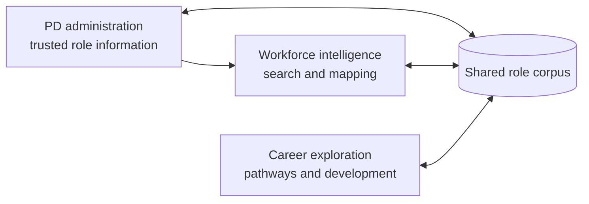
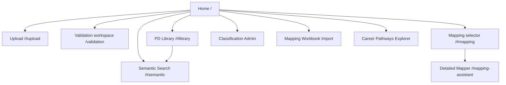
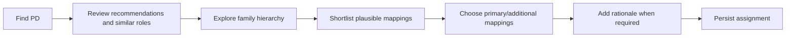

# PD Management System — current-state product map

**Status:** Connected local and hosted proof of concept
**Date:** 9 September 2026
**Purpose:** Establish what the product currently contains, who each part appears to serve, how users move through it, and which apparent features are not yet complete.

This is a product map, not a technical architecture or future-state design. It describes the experience currently available from the joined application and identifies decisions that should be made before the next substantial development phase.

## 1. Product proposition

The emerging product uses a common corpus of TAFE NSW position descriptions to support three related outcomes:

1. **Maintain trusted PD information** — ingest, review, validate and administer position-description data.
2. **Understand and map the workforce** — search roles, compare similar work and make governed job-family mapping decisions.
3. **Help people explore career movement** — reveal plausible adjacent and more-senior roles, compare options and understand potential development gaps.

These outcomes share data, but they are not the same user experience and will not necessarily have the same users or permissions.

The final arrow is important: validated and prepared PD information becomes evidence for search and mapping. Career exploration consumes the resulting role, activity, capability, classification and job-family information.

## 2. Likely user groups

The hosted proof of concept uses a single HTTP Basic sign-in for administration routes and a SELECT-only database account. It does not yet implement named users or role-based permissions. The following audiences are therefore **inferred from the functions**, not implemented access groups.

| User group | Primary need | Current product area |
| --- | --- | --- |
| PD content administrator | Ingest, correct and validate position descriptions | Upload and Validation Queue |
| Workforce/job architecture specialist | Maintain classifications and job-family structures; make mapping decisions | Classification Admin, Mapping Workbook Import and Mapping Assistant |
| HR/workforce analyst | Find roles, compare related work and inspect mapping evidence | PD Library and Semantic Search |
| Employee | Explore plausible career directions and compare roles | Career Pathways Explorer |
| Manager or career adviser | Discuss pathways and development gaps with an employee | Implied by Explorer actions, but no completed manager workflow |
| Technical/product administrator | Operate imports, refresh generated data and diagnose the application | Currently command-line and local operational processes |

## 3. Current product areas and screens

### A. PD administration workspace

The main application at `/` acts as both a home page and a container for several in-page workflows.

| Screen or view | Entry point | What the user can do | Persists changes? | Current status |
| --- | --- | --- | --- | --- |
| Product home | `/` | Choose Explorer, Upload, Validation, Role Library, Semantic Search, Mapping, Classification Admin or Workbook Import | No | Joined shell; protected in the hosted PoC |
| Upload Position Description | `/#upload` | Upload a Word `.docx`, extract its content and add the PD to the validation queue | Yes | Working locally; visibly disabled in the hosted read-only PoC |
| Validation workspace | `/validation` | Find a PD; inspect extracted and draft data; correct sections; record review status; validate; export trusted JSON; prepare intelligence | Yes | Complete editor integrated into the joined application; read-only in the hosted PoC |
| PD Library | `/#library` | Find a PD by number/title and inspect role details, related roles and current mapping context | No | Working locally |
| Classification Admin | `/admin/classifications` | Maintain display label, abbreviation, cohort, seniority order, agreement/source, active status and notes; export CSV/JSON | Yes | Working locally; visibly read-only in the hosted PoC |
| Reference Data Workbook | `/#workbook` | Download, validate and atomically replace the job-family framework, role mappings and family adjacency matrix as one `.xlsx` release | Yes, high impact | Download available in the protected hosted PoC; upload preview/apply working locally and blocked on Railway; controlled Supabase maintenance command available |

### B. Workforce intelligence and mapping

| Screen or view | Entry point | What the user can do | Persists changes? | Current status |
| --- | --- | --- | --- | --- |
| Semantic Search | `/#semantic` | Describe work in natural language; receive semantically related roles and suggested job families | No | Connected in the shell and working locally; intentionally disabled in the hosted PoC until a safe cloud embedding runtime is selected |
| Mapping Assistant selector | `/#mapping` | Find an unmapped or uncertain PD and open the detailed mapping workflow | No | Working locally |
| Detailed Mapping Assistant | `/mapping-assistant?pd=...` | Review ranked families, sub-families and specialisations; inspect similar-role evidence; shortlist; select primary/additional mappings; record rationale; assign | Yes | Working locally with live data; evidence remains viewable but assignment is disabled in the hosted PoC |
| Prepare intelligence | Validation workspace or mapping error recovery | Generate the mapping text/embedding needed for similarity and mapping assistance | Yes | Working locally, but still a user-triggered technical preparation step; disabled in the hosted PoC |

The Mapper is decision support. It recommends and supplies evidence, but the user makes and records the mapping decision.

### C. Career exploration

| Screen or state | Entry point | What the user can do | Persists changes? | Current status |
| --- | --- | --- | --- | --- |
| Starting-role search | `/career-explorer` | Find and select the employee's current role | No | Working locally |
| Guided walk | After selecting a role | See an initial plausible direction; inspect shared work and new work; choose to reveal the broader landscape | No | Working locally |
| Career landscape | Within Explorer | Explore an expanding constellation, inspect roles, and branch to same-grade or more-senior roles | No | Working locally and hosted |
| Role detail | Select an Explorer node | Review purpose, grade, shared activities, new activities and capability gaps | No | Working locally |
| Shortlist and comparison | Within Explorer | Shortlist up to three roles and compare them with the starting role | Browser-session state only | Working locally |
| Route to a role | Within Explorer | Display a calculated pathway from the starting role to a selected target | No | Working locally, subject to pathway coverage |
| Development plan | From comparison/detail | View suggested ways to build toward a role | No durable save | Demonstration experience; “Save my plan” is not yet a saved organisational workflow |
| Manager/learning/PD actions | Role detail | “Talk to my manager”, “Find learning” and “Read role description” | No | Visible concepts/placeholders; destination workflows are not connected |

The Explorer remains a deliberately self-contained employee experience so its refined interaction design is not altered. It is now linked from the joined product home and shared administration navigation.

## 4. Current navigation map

### Navigation observations

- Upload, Validation, Search, Mapping, Classification Admin and Workbook Import are presented as one administration-oriented product.
- Semantic Search is a primary route in the joined shell; the hosted model runtime is still pending.
- The detailed Mapper has its own screen and returns to the main application through shared links.
- The complete Validation editor is part of the joined FastAPI application and uses the same database and protected navigation as the other administration screens.
- The Explorer keeps its own interaction model and exact visual treatment, while the joined shell provides a clear entry to it.
- Administrative and employee-facing experiences are not yet separated by audience or permissions.

## 5. Current end-to-end journeys

### Journey 1 — add a new trusted PD

This is the clearest operational lifecycle currently represented in the product. The transition from validation to “prepare intelligence” is functional but exposes a technical processing concern to the user.

### Journey 2 — map an existing role

This is a governed human-decision workflow rather than an automatic classification function.

### Journey 3 — explore a career direction

This journey is useful for discovery, but it presently ends inside the prototype. It does not yet create a durable plan, learning enrolment, manager conversation or internal opportunity action.

## 6. Shared product information

All three product areas draw from the same unified role data. Their use of it differs:

| Information | PD administration | Mapping/search | Career exploration |
| --- | --- | --- | --- |
| Role identity and title | Maintain/validate | Find and compare | Select and display |
| Purpose and accountabilities | Maintain/validate | Similarity evidence | Role description and shared/new work context |
| Classification/grade | Administer | Filter and mapping evidence | Same-grade/more-senior movement |
| Capabilities | Maintain/validate | Comparison signals | Capability-gap display |
| Job-family hierarchy | Import/administer | Recommend and assign | Constrain/interpret related directions |
| Activities | Generated/maintained upstream | Similarity signals | Shared work and new work explanations |
| Embeddings/similarity outputs | Prepare | Core search and recommendation mechanism | Not the primary live Explorer mechanism |
| Pathway candidate scores | Generated upstream | Not a primary Mapper output | Constellation and route recommendations |

## 7. Product maturity: what is real and what is provisional

### Functionally real in the local proof of concept

- A shared role corpus and stable role identities.
- Word PD ingestion and structured extraction.
- Human review, correction and validation.
- Exact and semantic role search.
- Similar-role evidence and job-family recommendations.
- Persisted human mapping assignments.
- Classification and job-family reference administration.
- Live career constellation generation, branching, comparison and route display.

### Provisional, incomplete or local-only

- The hosted administration area has one shared HTTP Basic credential, but no named user identity, application roles or enterprise SSO.
- No employee-specific starting role from an HR identity/profile system.
- No saved Explorer shortlist, career plan or history.
- No connection to learning, vacancies, talent profiles or manager workflows.
- Explorer job-family tier relationships still include provisional reference configuration.
- The standalone port `8765` validator remains available only as a local compatibility entry point; the joined product no longer depends on it.
- Some generated intelligence requires manual preparation or rebuild commands.
- High-impact administration functions have no approval workflow; hosted mutations are blocked and visibly disabled, while the full local profile remains intentionally writable.
- The administration, search and mapping screens now share a shell; the Explorer intentionally retains its distinct refined experience.
- Local SQLite and file storage are appropriate to the proof of concept, not the target 10,000-user operating model.

## 8. Product decisions exposed by this map

The next phase should answer these in order:

1. **Product boundary:** Is this one product with role-based workspaces, or an administration product plus a separately branded employee Career Explorer?
2. **Primary audiences:** Which users can view roles, validate PDs, assign mappings, administer reference data and use career exploration?
3. **Information architecture:** What belongs in the permanent primary navigation for each audience?
4. **Career outcome:** Is the Explorer only for discovery, or should it lead to saved plans, learning, opportunities and manager conversations?
5. **Governance workflow:** Do mapping and reference-data changes require review, approval, effective dates and audit history?
6. **Processing model:** Which extraction, embedding and pathway calculations should happen automatically after an approved change?
7. **Product language:** Should “PD Manager”, “PD Management System”, “Mapping Assistant” and “Career Pathways Explorer” remain separate labels or sit beneath one agreed product identity?

## 9. Recommended immediate product-design sequence

1. Confirm the product boundary and audiences.
2. Define a permission-aware navigation model.
3. Agree the two or three most important end-to-end journeys.
4. Mark every current screen as **retain**, **integrate**, **redesign**, **restrict** or **retire**.
5. Produce the future-state product map.
6. Only then sequence the next development backlog and enterprise architecture work.

This current-state map should be updated whenever a screen, persistent workflow or product boundary materially changes.
